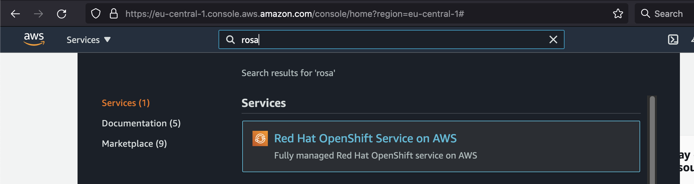
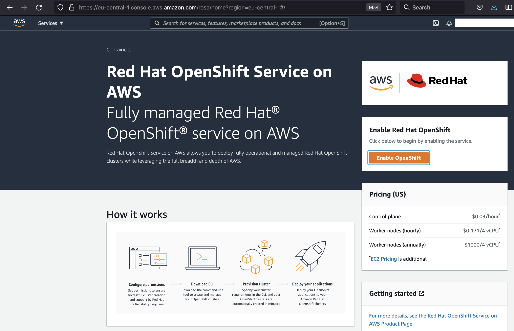
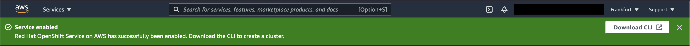
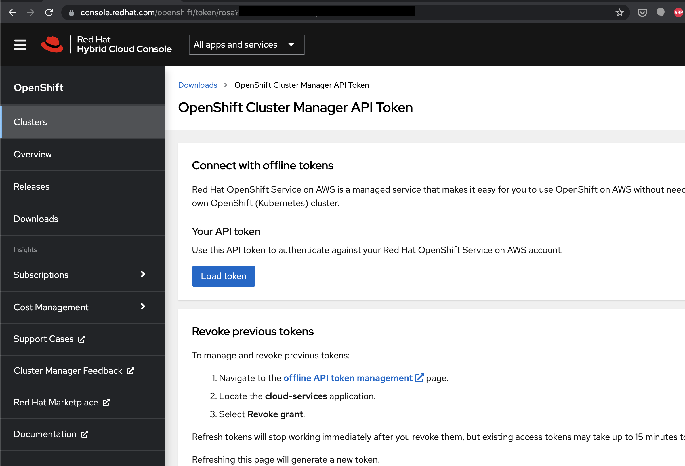

# openshift-aws
Evalutating the ROSA (Redhat OpenShift on AWS) service

What is ROSA?

> Red Hat OpenShift Service on AWS (ROSA) is a fully-managed OpenShift service, jointly managed and supported by both Red Hat and Amazon Web Services (AWS). Having your clusters maintained by this service gives you the freedom to focus on deploying applications. (see https://docs.openshift.com/rosa/rosa_architecture/rosa-understanding.html)

## Pricing

`There's no free lunch` - so here's the pricing: https://aws.amazon.com/rosa/pricing/ 

As of writing this is: 

1.) hourly fee for the cluster, which is $0.03/cluster/hour**
2.) pricing per worker node, which is $0.171 per 4 vCPU / hour for On-demand consumption


## Enable ROSA inside your AWS account

> [To create a new cluster](https://docs.openshift.com/rosa/rosa_architecture/rosa-understanding.html#rosa-cluster-consoles_rosa-understanding), start from the AWS Management console using ROSA. This integrates with the new rosa CLI and API to provision clusters in your AWS account. The new API for cluster creation alleviates the burden of manually deploying the cluster in your existing VPC and account.

So let's have a look into the AWS console and search for `rosa`:



Now in the ROSA AWS service overview we need to click on `Enable Red Hat OpenShift`:



This might take a while and will also share your contact information with Red Hat, since the cluster will be managed by Red Hat's SRE team.


## Install rosa CLI & create Red Hat account



Now when the ROSA service is enabled for our account, we need to install the rosa CLI:

[The docs state](https://docs.openshift.com/rosa/rosa_getting_started/rosa-installing-rosa.html) in order to download the `rosa` CLI, we need to create a Red Hat account first.

But on a Mac we can simply use brew to install it:

```
brew install rosa-cli
```

Now before proceeding with creating a offline access token we'll need for the `rosa login` command, we finally need a Red Hat account. Head over to https://console.redhat.com and create your account (or log in if you already have one). 

If we have an account we can create the needed offline access token at https://console.redhat.com/openshift/token/rosa

Click on `Load Token` to create one:



Now head over to the `rosa` CLI and login with the token:

```
rosa login --token="yourTokenHere(multiplelines)"
```

After running the command something like this should be printed out:
```
...
I: Logged in as 'jonashackt' on 'https://api.openshift.com'
```


## Initialize a ROSA on AWS

Be sure to have the AWS account configured in your `aws` CLI in which you enabled ROSA using the console. Therefore check your Access Key and Secret:

```
aws configure
```

Now we need to check if our AWS account & Red Hat account are ready to run ROSA.

```
rosa whoami
```

Finally initalize the cluster with

```
rosa init
```

That should output something like:

```
$ rosa init
rosa init
I: Logged in as 'jonashackt' on 'https://api.openshift.com'
I: Validating AWS credentials...
I: AWS credentials are valid!
I: Validating SCP policies...
I: AWS SCP policies ok
I: Validating AWS quota...
I: AWS quota ok. If cluster installation fails, validate actual AWS resource usage against https://docs.openshift.com/rosa/rosa_getting_started/rosa-required-aws-service-quotas.html
I: Ensuring cluster administrator user 'osdCcsAdmin'...
I: Admin user 'osdCcsAdmin' created successfully!
I: Validating SCP policies for 'osdCcsAdmin'...
I: AWS SCP policies ok
I: Validating cluster creation...
I: Cluster creation valid
I: Verifying whether OpenShift command-line tool is available...
W: OpenShift command-line tool is not installed.
Run 'rosa download oc' to download the latest version, then add it to your PATH.
```


## Installing a current version OpenShift oc CLI

Sadly simply running `brew install openshift-cli` isn't enough, because this will result in `rosa` CLI complaining about the `oc` version like this:

```
rosa verify oc

I: Verifying whether OpenShift command-line tool is available...
W: Current OpenShift Client Version: v4.2.0-alpha.0-657-g51011e4
W: Your version of the OpenShift command-line tool is not supported.
Run 'rosa download oc' to download the latest version, then add it to your PATH.
```

And if we have a look at the brew formulae at https://formulae.brew.sh/formula/openshift-cli & https://formulae.brew.sh/api/formula/openshift-cli.json, we'll soon find the problem: The last release in the used repo is from June 2020: https://github.com/openshift/oc/releases :(((

So we have to do what the ROSA or [OpenShift docs](https://docs.openshift.com/container-platform/4.8/cli_reference/openshift_cli/getting-started-cli.html#installing-openshift-cli) tell us - we need to download the binary and add it to our `PATH` manually. There's a `rosa` CLI shortcut for downloading the latest and matching `oc` version:

```
rosa download oc
```

This will download the `oc` binary inside a `tar.gz` from https://mirror.openshift.com/pub/openshift-v4/clients/ocp/latest/ into the current directory. Unpack it and put the `oc` binary somewhere your `$PATH` is configured to look into (run `echo $PATH` to see these folders). On a Mac I simply moved (only!) the `oc` binary to `/usr/local/bin`.

If everything went fine a `oc version` should print something and the `rosa verify oc` should stop complaining:

```
$ rosa verify oc

I: Verifying whether OpenShift command-line tool is available...
I: Current OpenShift Client Version: 4.8.11
```

## Create a ROSA cluster on AWS

Finally we're where we wanted to be in the first place. Let's create our cluster:

```
rosa create cluster --cluster-name=my-first-rosa
```


This should print something like this:

```
rosa create cluster --cluster-name=my-first-rosa
I: Creating cluster 'my-first-rosa'
I: To view a list of clusters and their status, run 'rosa list clusters'
I: Cluster 'my-first-rosa' has been created.
I: Once the cluster is installed you will need to add an Identity Provider before you can login into the cluster. See 'rosa create idp --help' for more information.
I: To determine when your cluster is Ready, run 'rosa describe cluster -c my-first-rosa'.
I: To watch your cluster installation logs, run 'rosa logs install -c my-first-rosa --watch'.
Name:                       my-first-rosa
ID:                         somecoolidhere
External ID:
OpenShift Version:
Channel Group:              stable
DNS:                        my-first-rosa.dt1y.p1.openshiftapps.com
AWS Account:                12345678
API URL:
Console URL:
Region:                     eu-central-1
Multi-AZ:                   false
Nodes:
 - Master:                  3
 - Infra:                   2
 - Compute:                 2
Network:
 - Service CIDR:            172.30.0.0/16
 - Machine CIDR:            10.0.0.0/16
 - Pod CIDR:                10.128.0.0/14
 - Host Prefix:             /23
State:                      pending (Preparing account)
Private:                    No
Created:                    Sep 14 2021 08:16:54 UTC
Details Page:               https://console.redhat.com/openshift/details/s/9827354903759375
```

Show the status of the cluster with

```
rosa list clusters
```

## Links

ROSA docs: https://docs.openshift.com/rosa/welcome/index.html